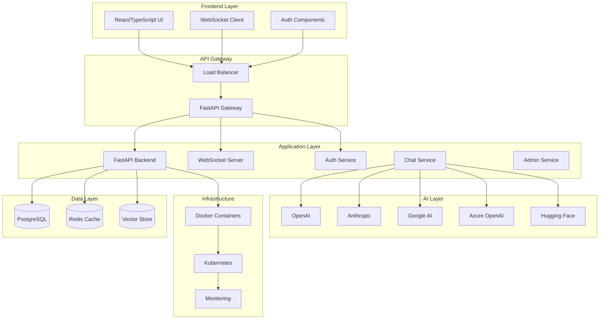
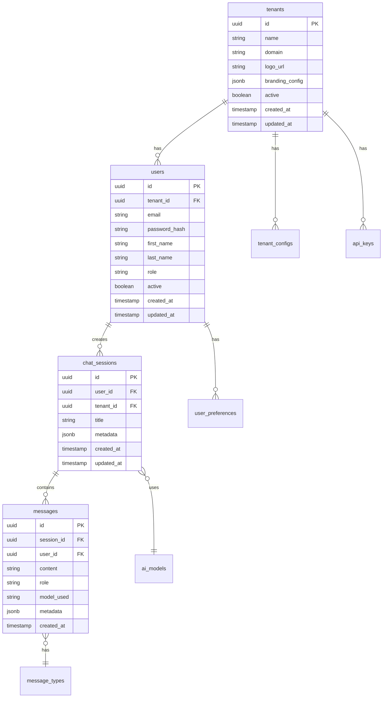
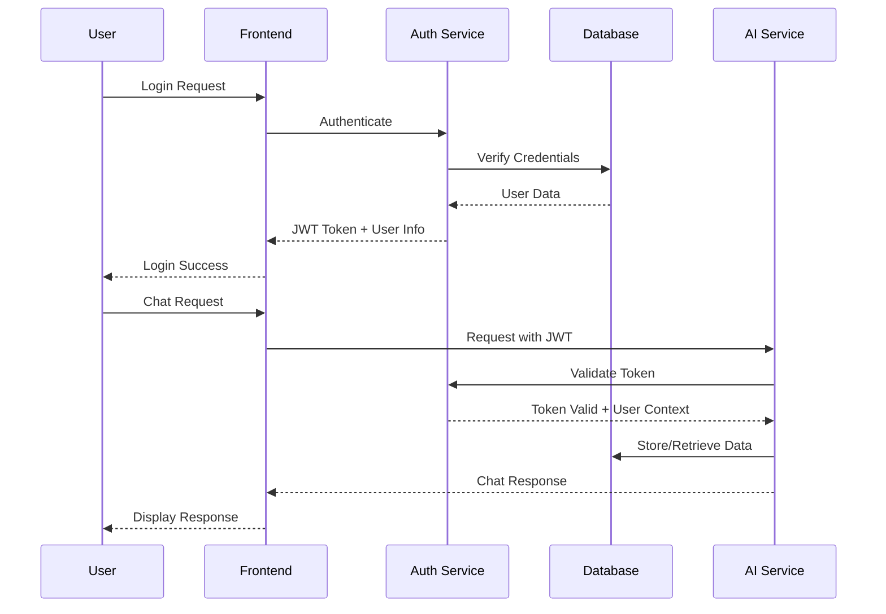
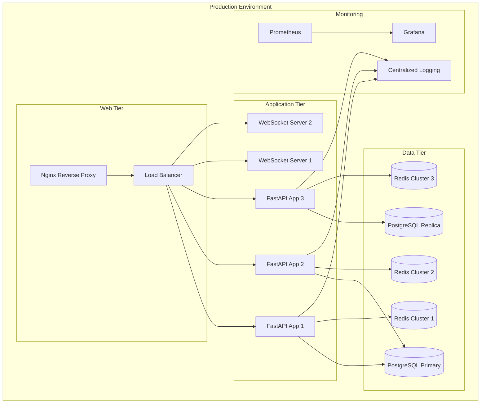
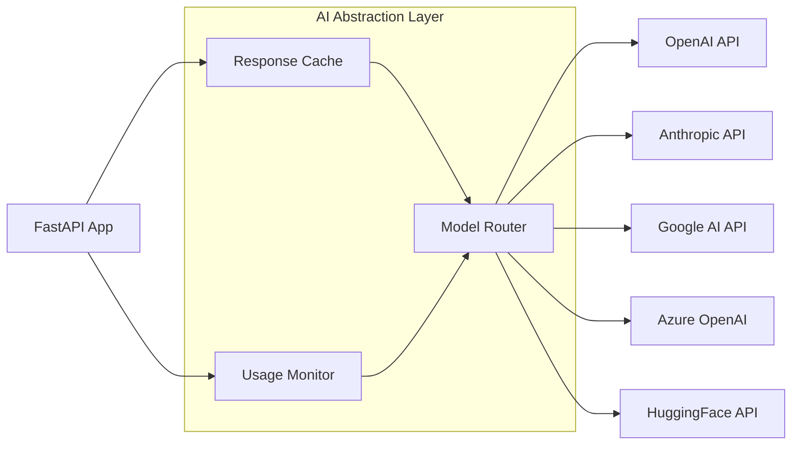
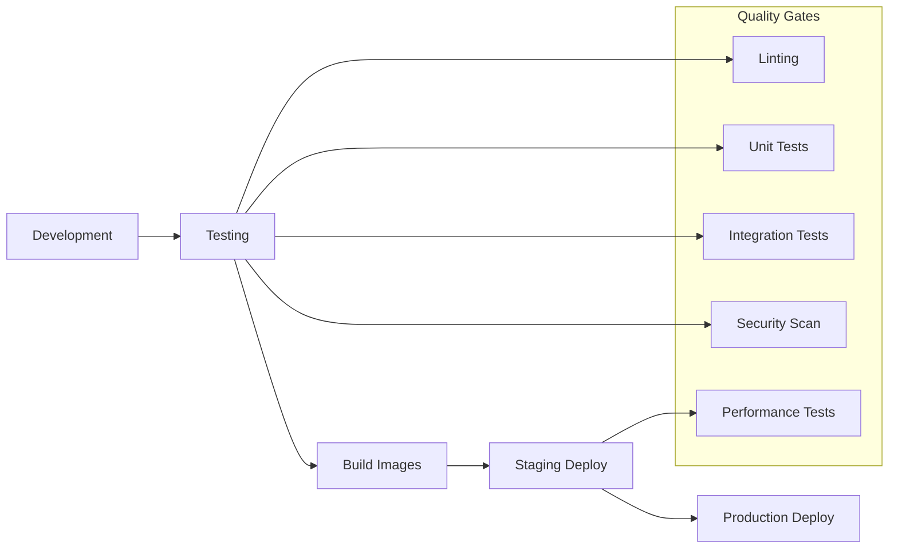

# 🏗️ GenAI Chatbot Platform - Architecture Documentation

## 📖 Overview

The GenAI Chatbot Platform is a production-ready, multi-tenant, enterprise-grade conversational AI platform built with modern web technologies and designed for scalability, security, and extensibility.

## 🏛️ System Architecture

## 🗄️ Database Architecture

### Multi-Tenant Data Model

## 🔐 Security Architecture

### Authentication Flow

### Multi-Tenant Security

- **Row-Level Security (RLS)**: PostgreSQL RLS policies ensure tenant data isolation
- **JWT Tokens**: Include tenant context for request authorization
- **API Key Isolation**: Tenant-specific AI provider API keys
- **Data Encryption**: At rest and in transit encryption
- **Audit Logging**: Comprehensive activity logging per tenant

## 🚀 Deployment Architecture

### Container Architecture

## 🧩 Component Architecture

### Backend Services

| Service | Purpose | Technology | Scalability |
|---------|---------|------------|-------------|
| **Auth Service** | User authentication & authorization | FastAPI + JWT | Horizontal |
| **Chat Service** | Chat management & AI integration | FastAPI + Async | Horizontal |
| **Admin Service** | Tenant & system administration | FastAPI + RBAC | Vertical |
| **WebSocket Service** | Real-time communication | FastAPI WebSockets | Horizontal |
| **File Service** | Document upload & processing | FastAPI + Celery | Horizontal |

### Frontend Components

| Component | Purpose | Technology | Reusability |
|-----------|---------|------------|-------------|
| **Chat Interface** | Main chat experience | React + TypeScript | High |
| **Admin Dashboard** | System administration | React + Material-UI | Medium |
| **Auth Components** | Login/register/profile | React Hooks | High |
| **Settings Panel** | User preferences | React + Forms | High |
| **File Manager** | Document management | React + Upload | Medium |

## 📊 Performance Architecture

### Scalability Patterns

1. **Horizontal Scaling**: Stateless API servers behind load balancer
2. **Database Sharding**: Tenant-based sharding strategy
3. **Caching Strategy**: Multi-layer caching (Redis, CDN, Browser)
4. **Background Jobs**: Celery for async processing
5. **WebSocket Scaling**: Redis pub/sub for multi-server chat

### Performance Metrics

- **Response Time**: < 200ms for API calls
- **Chat Latency**: < 500ms for AI responses
- **Concurrent Users**: 10,000+ per instance
- **Database**: Read replicas for scaling
- **Caching**: 90%+ cache hit rate

## 🔌 Integration Architecture

### AI Provider Integration

### External Integrations

- **OAuth Providers**: Google, Microsoft, Apple, GitHub
- **File Storage**: AWS S3, Google Cloud Storage, Azure Blob
- **Monitoring**: Datadog, New Relic, Prometheus
- **Email**: SendGrid, Mailgun, AWS SES
- **Analytics**: Mixpanel, Google Analytics

## 🛡️ Compliance & Security

### Security Standards

- **OWASP Top 10**: Full compliance
- **SOC 2 Type II**: Security controls
- **GDPR**: Data privacy compliance
- **ISO 27001**: Information security management
- **OAuth 2.0 / OpenID Connect**: Standard authentication

### Data Protection

- **Encryption**: AES-256 at rest, TLS 1.3 in transit
- **Key Management**: HashiCorp Vault or AWS KMS
- **Data Retention**: Configurable per tenant
- **Right to Deletion**: GDPR compliance
- **Audit Trails**: Immutable activity logs

## 🔄 Development Workflow

### CI/CD Pipeline

### Technology Stack Summary

| Layer | Technology | Purpose |
|-------|------------|---------|
| **Frontend** | React 18 + TypeScript + Material-UI | User interface |
| **Backend** | FastAPI + Python 3.11 + SQLAlchemy | API services |
| **Database** | PostgreSQL 15 + Redis 7 | Data persistence |
| **Message Queue** | Celery + Redis | Background tasks |
| **Search** | Elasticsearch | Full-text search |
| **Monitoring** | Prometheus + Grafana | Observability |
| **Containerization** | Docker + Kubernetes | Deployment |
| **CI/CD** | GitHub Actions | Automation |

---

## 📈 Roadmap & Future Enhancements

1. **Phase 1**: Core platform with basic multi-tenancy
2. **Phase 2**: Advanced AI features and integrations  
3. **Phase 3**: Enterprise features and compliance
4. **Phase 4**: Mobile apps and advanced analytics
5. **Phase 5**: AI marketplace and custom models

This architecture provides a solid foundation for building a scalable, secure, and maintainable GenAI chatbot platform that can grow with your business needs.
